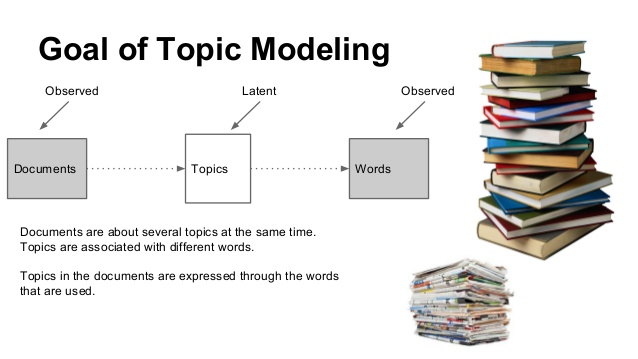
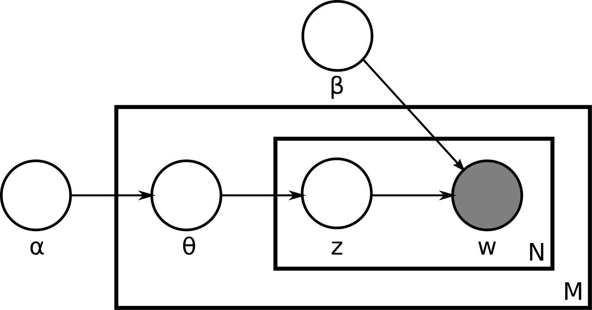

```{r setup, include=FALSE}
knitr::opts_chunk$set(echo = TRUE, 
                      fig.align = "center")

options(scipen = 999)
```

Natural Languange Processing has a wide area of knowledge and implementation, one of them is Topic Model. Topic Model is a **type of statistical model for discovering the abstract "topics" that occur in a collection of documents**. Topic modeling is a frequently used text-mining tool for discovery of hidden semantic structures in a text body. For example "dog", "bone", and "obedient" will appear more often in document about dogs, "cute", "evil", and "home owner" will appear in document about cats. The "topics" produced by topic modeling techniques are clusters of similar words. A topic model captures this intuition in a mathematical framework, which allows examining a set of documents and discovering, based on the statistics of the words in each, what the topics might be and what each document's balance of topics is.   

In this article, we will learn to do Topic Model using `tidytext` and `textmineR` packages. In `tidytext` we can easily build Topic Model and visualize it with tidy style but the package itself doesn't focus on that study only. thus the functionality for topic model are not comprehensive as `textmineR`. In `textmineR`, not only building a topic model, we also can calculate the goodness of fit of the model. We will use both package to build topic model using *Latent Dirichlet Allocation* (LDA) algorithm.

```{r,echo = FALSE}

```

# Background {.tabset}
## Introduction
**What is Topic Modeling**
Topic Modeling is how the machine collect group of words within a document to build 'topic' which contain group of words with similar dependencies. With Topic models (or topic modeling, or topic model, its just the same) methods we can organize, understand and summarize large collections of textual information. It helps in:

- Discovering hidden topical patterns that are present across the collection   
- Annotating documents according to these topics   
- Using these annotations to organize, search and summarize texts   

There are many techniques that are used to obtain topic models, namely: Latent Dirichlet Allocation (LDA), Latent Semantic Analysis (LSA), Correlated Topic Models (CTM) and TextRank. In this study we will focus to implement LDA algorithm to build topic model with `tidytext` and `textmineR` package. Not only building model, we will also evaluate the goodness of fit of the model using some metrics like R-squared or log-likelihood. There's also some metrics like `coherence` and `prevalence` to measure the quality of topics.

## Libraries
```{r warning=FALSE, message=FALSE}
# data wrangling
library(dplyr)
library(tidyr)
library(lubridate)
# visualization
library(ggplot2)
# dealing with text
library(textclean)
library(tm)
library(SnowballC)
library(stringr)
# topic model
library(tidytext)
library(topicmodels)
library(textmineR)
```

# Let's Begin!
## Topic Model
From the introduction above we know that there are several ways to do topic model. In this study we will use LDA algorithm. LDA is a mathematical model that is used to find a mixture of words to each topic, also determine the mixture of topics that describe each document. LDA answer these following principles of topic modeling:   

- Every document is a mixture of topics. We imagine that each document may contain words from several topics in particular proportions. For example, in a two-topic model we could say “Document 1 is 90% topic A and 10% topic B, while Document 2 is 30% topic A and 70% topic B.” This also can be symbolized as $\Theta$ `theta`   
- Every topic is a mixture of words. For example, we could imagine a two-topic model of American news, with one topic for “politics” and one for “entertainment.” The most common words in the politics topic might be “President”, “Congress”, and “government”, while the entertainment topic may be made up of words such as “movies”, “television”, and “actor”. Importantly, words can be shared between topics; a word like “budget” might appear in both equally. This also can be symbolized as $\Phi$ `phi`   

We will use two packages: `tidytext` including `tidymodels` package and `textmineR`. Tidytext package build topic model easily and they provide method for extracting the per-topic-per-word probabilities, called $\beta$ (“beta”), from the model. But they don't provide metrics to calculate the goodness of model like `textmineR` do.   

## Latent Dirichlet Allocation (LDA)

LDA is a generative statistical model that allows sets of observations to be explained by unobserved groups that explain why some parts of the data are similar. For example, if observations are words collected into documents, it posits that each document is a mixture of a small number of topics and that each word's presence is attributable to one of the document's topics. `Plate Notation` (picture below) is a concise way of visually representing the dependencies among the model parameters.

```{r,echo=FALSE}

```

- Area in $M$ denotes the number of documents   
- $N$ is number of words in a given document   
- $\alpha$ is the parameter of the Dirichlet prior on the per-document topic distributions. High $\alpha$ indicates that each documents is likely to contain a mixture of most of the topics (not just one or two). Low $\alpha$ indicates each document will likely to contain just few of topics   
- $\beta$ is the parameter of the Dirichlet prior on the per-topic word distribution. High $\beta$ indicates that each topic will contain a mixture of most in the words. low $\beta$ indicates topic have low mixture of words.   
- $\theta_{m}$ is the topic distribution for document *m*   
- $z_{mn}$ is the topic for the *n*-th word in document *m*   
- $w_{mn}$ is the specific word   

LDA is a generative process. LDA assumes that new documents are created in the following way:   
1. Determine number of words in document   
2. Choose a topic mixture for the document over a fixed set of topics (example: 20% topic A, 50$ topic B, 30% topic C)  
3. Generate the words in the document by:   
- pick a topic based on the document's multinomial distribution ($z_{m,n} \sim {\sf Multinomial(\theta_{m})}$)   
- pick a word based on topic's multinomial distribution ($w_{m,n} \sim {\sf Multinomial(\varphi_{z_{mn}})}$) (where $\varphi_{z_{mn}}$  is the word distribution for topic *z*)   
4. Repeat the process for *n* number of iteration until the words distribution in the topics meet the criteria (number 2)   


## Data Import & Objectives
The data is from [this kaggle](https://www.kaggle.com/eswarchandt/amazon-music-reviews?select=Musical_instruments_reviews.csv). Its about customers feedback on Amazon musical instruments. Every row represent one feedback from one user. There are several columns but we only need `reviewText` which contain the text of the review, `overall` the product rating from 1-5 given by user, and `reviewTime` which contain the time review was given.


```{r}
data <- read.csv("Musical_instruments_reviews.csv")
head(data)
```

Clean reviewTime column and convert to time format. Also deselect to unnecessary columns.
```{r}
data <- data %>%
  mutate(overall = as.factor(overall),
         reviewTime = str_replace_all(reviewTime, pattern = " ",replacement = "-"),
         reviewTime = str_replace(reviewTime, pattern = ",",replacement = ""),
         reviewTime = mdy(reviewTime)) %>%
  select(reviewText, overall,reviewTime)
head(data)
```

So the objectives in this project is to **discover what users are talk about for each rating**. This will help the organization to understand better about their customer feedback's So that they can concentrate on those issues customer's are facing.

# `tidytext`
## Text Cleaning
Before we put the text to LDA model, we need to clean the text. We gonna build `textcleaner` function using several function from `tm`, `textclean`, and `stringr` package. We also need to convert the text to Document Term Matrix (DTM) format because `LDA()` function from `tidytext` package need dtm format.

```{r}
# build textcleaner function
textcleaner <- function(x){
  x <- as.character(x)
  
  x <- x %>%
    str_to_lower() %>%  # convert all the string to low alphabet
    replace_contraction() %>% # replace contraction to their multi-word forms
    replace_internet_slang() %>% # replace internet slang to normal words
    replace_emoji() %>% # replace emoji to words
    replace_emoticon() %>% # replace emoticon to words
    replace_hash(replacement = "") %>% # remove hashtag
    replace_word_elongation() %>% # replace informal writing with known semantic replacements
    replace_number(remove = T) %>% # remove number
    replace_date(replacement = "") %>% # remove date
    replace_time(replacement = "") %>% # remove time
    str_remove_all(pattern = "[[:punct:]]") %>% # remove punctuation
    str_remove_all(pattern = "[^\\s]*[0-9][^\\s]*") %>% # remove mixed string n number
    str_squish() %>% # reduces repeated whitespace inside a string.
    str_trim() # removes whitespace from start and end of string
  
  xdtm <- VCorpus(VectorSource(x)) %>%
    tm_map(removeWords, stopwords("en"))
  
  # convert corpus to document term matrix
  return(DocumentTermMatrix(xdtm))
    
}

```

## Split by rating
Because we want to know the topic from each rating, we should split/subset the data by its rating.

```{r}
data_1 <- data %>% filter(overall == 1)
data_2 <- data %>% filter(overall == 2)
data_3 <- data %>% filter(overall == 3)
data_4 <- data %>% filter(overall == 4)
data_5 <- data %>% filter(overall == 5)
table(data$overall)
```

From the table above we know that most of the feedback have the highest rating. Because the distributions is different, each rating will have different treatment especially in choosing highest terms frequency. I'll make sure we will use at least 700-1000 words to be analyzed for each rating.


## Topic Modeling rating 5

```{r}
# apply textcleaner function for review text
dtm_5 <- textcleaner(data_5$reviewText)
# find most frequent terms. i choose words that at least appear in 50 reviews
freqterm_5 <- findFreqTerms(dtm_5,50)
# we have 981 words. subset the dtm to only choose those selected words
dtm_5 <- dtm_5[,freqterm_5]
# only choose words that appear once in each rows
rownum_5 <- apply(dtm_5,1,sum)
dtm_5 <- dtm_5[rownum_5>0,]
```

```{r}
# apply to LDA function. set the k = 6, means we want to build 6 topic 
lda_5 <- LDA(dtm_5,k = 6,control = list(seed = 1502))
# apply auto tidy using tidy and use beta as per-topic-per-word probabilities
topic_5 <- tidy(lda_5,matrix = "beta")

# choose 15 words with highest beta from each topic
top_terms_5 <- topic_5 %>%
  group_by(topic) %>%
  top_n(15,beta) %>% 
  ungroup() %>%
  arrange(topic,-beta)
```

```{r}
# plot the topic and words for easy interpretation
plot_topic_5 <- top_terms_5 %>%
  mutate(term = reorder_within(term, beta, topic)) %>%
  ggplot(aes(term, beta, fill = factor(topic))) +
  geom_col(show.legend = FALSE) +
  facet_wrap(~ topic, scales = "free") +
  coord_flip() +
  scale_x_reordered()

plot_topic_5
```

## Topic Modeling rating 4

```{r}
dtm_4 <- textcleaner(data_4$reviewText)
freqterm_4 <- findFreqTerms(dtm_4,20)
dtm_4 <- dtm_4[,freqterm_4]
rownum_4 <- apply(dtm_4,1,sum)
dtm_4 <- dtm_4[rownum_4>0,]
```

```{r}
lda_4 <- LDA(dtm_4,k = 6,control = list(seed = 1502))
topic_4 <- tidy(lda_4,matrix = "beta")

top_terms_4 <- topic_4 %>%
  group_by(topic) %>%
  top_n(15,beta) %>% 
  ungroup() %>%
  arrange(topic,-beta)
```

```{r}
plot_topic_4 <- top_terms_4 %>%
  mutate(term = reorder_within(term, beta, topic)) %>%
  ggplot(aes(term, beta, fill = factor(topic))) +
  geom_col(show.legend = FALSE) +
  facet_wrap(~ topic, scales = "free") +
  coord_flip() +
  scale_x_reordered()

plot_topic_4
```

## Topic Modeling rating 3

```{r}
dtm_3 <- textcleaner(data_3$reviewText)
freqterm_3 <- findFreqTerms(dtm_3,10)
dtm_3 <- dtm_3[,freqterm_3]
rownum_3 <- apply(dtm_3,1,sum)
dtm_3 <- dtm_3[rownum_3>0,]
```

```{r}
lda_3 <- LDA(dtm_3,k = 6,control = list(seed = 1502))
topic_3 <- tidy(lda_3,matrix = "beta")

top_terms_3 <- topic_3 %>%
  group_by(topic) %>%
  top_n(15,beta) %>% 
  ungroup() %>%
  arrange(topic,-beta)
```

```{r}
plot_topic_3 <- top_terms_3 %>%
  mutate(term = reorder_within(term, beta, topic)) %>%
  ggplot(aes(term, beta, fill = factor(topic))) +
  geom_col(show.legend = FALSE) +
  facet_wrap(~ topic, scales = "free") +
  coord_flip() +
  scale_x_reordered()

plot_topic_3
```

## Topic Modeling rating 2

```{r}
dtm_2 <- textcleaner(data_2$reviewText)
freqterm_2 <- findFreqTerms(dtm_2,5)
dtm_2 <- dtm_2[,freqterm_2]
rownum_2 <- apply(dtm_2,1,sum)
dtm_2 <- dtm_2[rownum_2>0,]
```

```{r}
lda_2 <- LDA(dtm_2,k = 6,control = list(seed = 1502))
topic_2 <- tidy(lda_2,matrix = "beta")

top_terms_2 <- topic_2 %>%
  group_by(topic) %>%
  top_n(15,beta) %>% 
  ungroup() %>%
  arrange(topic,-beta)
```

```{r}
plot_topic_2 <- top_terms_2 %>%
  mutate(term = reorder_within(term, beta, topic)) %>%
  ggplot(aes(term, beta, fill = factor(topic))) +
  geom_col(show.legend = FALSE) +
  facet_wrap(~ topic, scales = "free") +
  coord_flip() +
  scale_x_reordered()

plot_topic_2
```

## Topic Modeling rating 1

```{r}
dtm_1 <- textcleaner(data_1$reviewText)
freqterm_1 <- findFreqTerms(dtm_1,5)
dtm_1 <- dtm_1[,freqterm_1]
rownum_1 <- apply(dtm_1,1,sum)
dtm_1 <- dtm_1[rownum_1>0,]
```

```{r}
lda_1 <- LDA(dtm_1,k = 6,control = list(seed = 1502))
topic_1 <- tidy(lda_1,matrix = "beta")

top_terms_1 <- topic_1 %>%
  group_by(topic) %>%
  top_n(15,beta) %>% 
  ungroup() %>%
  arrange(topic,-beta)
```

```{r}
plot_topic_1 <- top_terms_1 %>%
  mutate(term = reorder_within(term, beta, topic)) %>%
  ggplot(aes(term, beta, fill = factor(topic))) +
  geom_col(show.legend = FALSE) +
  facet_wrap(~ topic, scales = "free") +
  coord_flip() +
  scale_x_reordered()

plot_topic_1
```

# `textmineR`
## Text Cleaning

Just like previous text cleaning method, we will build text cleaner function to automate the cleaning process. The different is we don't need to convert the  text to dtm format. `textmineR` package has its own dtm converter, `CreateDtm()`. Fitting LDA model with `textmineR` need dtm format made by `CreateDtm()` function. We also can set n-gram size, remove punctuation, stopwords, and any simple text cleaning process.
```{r}
textcleaner_2 <- function(x){
  x <- as.character(x)
  
  x <- x %>%
    str_to_lower() %>%  # convert all the string to low alphabet
    replace_contraction() %>% # replace contraction to their multi-word forms
    replace_internet_slang() %>% # replace internet slang to normal words
    replace_emoji() %>% # replace emoji to words
    replace_emoticon() %>% # replace emoticon to words
    replace_hash(replacement = "") %>% # remove hashtag
    replace_word_elongation() %>% # replace informal writing with known semantic replacements
    replace_number(remove = T) %>% # remove number
    replace_date(replacement = "") %>% # remove date
    replace_time(replacement = "") %>% # remove time
    str_remove_all(pattern = "[[:punct:]]") %>% # remove punctuation
    str_remove_all(pattern = "[^\\s]*[0-9][^\\s]*") %>% # remove mixed string n number
    str_squish() %>% # reduces repeated whitespace inside a string.
    str_trim() # removes whitespace from start and end of string
  
  return(as.data.frame(x))
    
}
```

## Topic Modeling rating 5

```{r}
# apply textcleaner function. note: we only clean the text without convert it to dtm
clean_5 <- textcleaner_2(data_5$reviewText)
clean_5 <- clean_5 %>% mutate(id = rownames(clean_5))

# crete dtm
set.seed(1502)
dtm_r_5 <- CreateDtm(doc_vec = clean_5$x,
                   doc_names = clean_5$id,
                   ngram_window = c(1,2),
                   stopword_vec = stopwords("en"),
                   verbose = F)

dtm_r_5 <- dtm_r_5[,colSums(dtm_r_5)>2]

```

create LDA model using `textmineR`. Here we gonna make 20 topic. the reason why we build so many topic is because `textmineR` have metrics for calculate the quality of topics. we will choose some topics with the best quality
```{r}
set.seed(1502)
mod_lda_5 <- FitLdaModel(dtm = dtm_r_5,
                         k = 20, # number of topic
                         iterations = 500,
                         burnin = 180,
                         alpha = 0.1,beta = 0.05,
                         optimize_alpha = T,
                         calc_likelihood = T,
                         calc_coherence = T,
                         calc_r2 = T)
```

Once we have created a model, we need to evaluate it. For overall goodness of fit, textmineR has R-squared and log likelihood. R-squared is interpretable as the proportion of variability in the data explained by the model, as with linear regression. 

```{r}
mod_lda_5$r2
```

The primary goodness of fit measures in topic modeling are likelihood methods. Likelihoods, generally the log likelihood, are naturally obtained from probabilistic topic models. the log_likelihood is $P(tokens|topics)$ at each iteration. 

```{r}
plot(mod_lda_5$log_likelihood,type = "l")
```

get 15 top terms with the highest phi. phi representing a distribution of words over topics. Words with high phi has the most frequency in a topic.
```{r}
mod_lda_5$top_terms <- GetTopTerms(phi = mod_lda_5$phi,M = 15)
data.frame(mod_lda_5$top_terms)
```

Let's see the coherence value for each topics. Topic Coherence measures score a single topic by measuring the degree of semantic similarity between high scoring words in the topic. These measurements help distinguish between topics that are semantically interpretable topics and topics that are artifacts of statistical inference. For each pair of words $\{a,b\}$, then `probabilistic coherence` calculates $P(b|a) - P(b)$ where $\{a\}$ is more probable than $\{b\}$ in the topic. In a simple words, **coherence tell us how associated words are in a topic**

```{r}
mod_lda_5$coherence
```

We also want to look at prevalence value. Prevalence tell us the most frequent topics in the corpus. Prevelence is **probability of topics distribution in the whole documents**. 

```{r}
mod_lda_5$prevalence <- colSums(mod_lda_5$theta)/sum(mod_lda_5$theta)*100
mod_lda_5$prevalence
```

Now we have the top terms at each topic, goodness of model by r2 and log_likelihood, also the quality of topics by calculate coherence and prevalence. let's compile them in summary

```{r}
mod_lda_5$summary <- data.frame(topic = rownames(mod_lda_5$phi),
                                coherence = round(mod_lda_5$coherence,3),
                                prevalence = round(mod_lda_5$prevalence,3),
                                top_terms = apply(mod_lda_5$top_terms,2,function(x){paste(x,collapse = ", ")}))

modsum_5 <- mod_lda_5$summary %>%
  `rownames<-`(NULL)
modsum_5
```

We know that the quality of model can be describe with coherence and prevalence value. let's build a plot to identify which topic has the best quality

```{r}
modsum_5 %>% pivot_longer(cols = c(coherence,prevalence)) %>%
  ggplot(aes(x = factor(topic,levels = unique(topic)), y = value, group = 1)) +
  geom_point() + geom_line() +
  facet_wrap(~name,scales = "free_y",nrow = 2) +
  theme_minimal() +
  labs(title = "Best topics by coherence and prevalence score",
       subtitle = "Text review with 5 rating",
       x = "Topics", y = "Value")
```

From the graph above we know that `topic 7` has the highest quality, means the words in that topic are associated to each other. But in the terms of probability of topics distribution in the whole documents (prevalence), `topic 7` has a low score. Mean the review are unlikely using combination of words in `topic 7` even tough the words inside that topic are supporting each other.    

We can see if topics can be grouped together using `Dendogram`. A Dendogram uses [Hellinger distance](https://en.wikipedia.org/wiki/Hellinger_distance) (distance between 2 probability vectors) to decide if the topics are closely related. For instance, the Dendogram below suggests that there are greater similarity between topic 1 and 4.

```{r}
mod_lda_5$linguistic <- CalcHellingerDist(mod_lda_5$phi)
mod_lda_5$hclust <- hclust(as.dist(mod_lda_5$linguistic),"ward.D")
mod_lda_5$hclust$labels <- paste(mod_lda_5$hclust$labels, mod_lda_5$labels[,1])
plot(mod_lda_5$hclust)
```

Now we have complete to build topic model in rating 5 and its interpretation, let's apply the same step for every rating and see the difference of what people are talk about.

## Topic Modeling rating 4

```{r}
# apply textcleaner function. note: we only clean the text without convert it to dtm
clean_4 <- textcleaner_2(data_4$reviewText)
clean_4 <- clean_4 %>% mutate(id = rownames(clean_4))

# crete dtm
set.seed(1502)
dtm_r_4 <- CreateDtm(doc_vec = clean_4$x,
                   doc_names = clean_4$id,
                   ngram_window = c(1,2),
                   stopword_vec = stopwords("en"),
                   verbose = F)

dtm_r_4 <- dtm_r_4[,colSums(dtm_r_4)>2]

```

```{r}
set.seed(1502)
mod_lda_4 <- FitLdaModel(dtm = dtm_r_4,
                         k = 20, # number of topic
                         iterations = 500,
                         burnin = 180,
                         alpha = 0.1,beta = 0.05,
                         optimize_alpha = T,
                         calc_likelihood = T,
                         calc_coherence = T,
                         calc_r2 = T)
mod_lda_4$r2
```

```{r}
mod_lda_4$top_terms <- GetTopTerms(phi = mod_lda_4$phi,M = 15)
data.frame(mod_lda_4$top_terms)
```

```{r}
mod_lda_4$prevalence <- colSums(mod_lda_4$theta)/sum(mod_lda_4$theta)*100
mod_lda_4$prevalence
mod_lda_4$coherence
```

```{r}
mod_lda_4$summary <- data.frame(topic = rownames(mod_lda_4$phi),
                                coherence = round(mod_lda_4$coherence,3),
                                prevalence = round(mod_lda_4$prevalence,3),
                                top_terms = apply(mod_lda_4$top_terms,2,function(x){paste(x,collapse = ", ")}))

modsum_4 <- mod_lda_4$summary %>%
  `rownames<-`(NULL)
modsum_4
```


```{r}
modsum_4 %>% pivot_longer(cols = c(coherence,prevalence)) %>%
  ggplot(aes(x = factor(topic,levels = unique(topic)), y = value, group = 1)) +
  geom_point() + geom_line() +
  facet_wrap(~name,scales = "free_y",nrow = 2) +
  theme_minimal() +
  labs(title = "Best topics by coherence and prevalence score",
       subtitle = "Text review with 4 rating",
       x = "Topics", y = "Value")
```

```{r}
mod_lda_4$linguistic <- CalcHellingerDist(mod_lda_4$phi)
mod_lda_4$hclust <- hclust(as.dist(mod_lda_4$linguistic),"ward.D")
mod_lda_4$hclust$labels <- paste(mod_lda_4$hclust$labels, mod_lda_4$labels[,1])
plot(mod_lda_4$hclust)
```

## Topic Modeling rating 3

```{r}
# apply textcleaner function. note: we only clean the text without convert it to dtm
clean_3 <- textcleaner_2(data_3$reviewText)
clean_3 <- clean_3 %>% mutate(id = rownames(clean_3))

# crete dtm
set.seed(1502)
dtm_r_3 <- CreateDtm(doc_vec = clean_3$x,
                   doc_names = clean_3$id,
                   ngram_window = c(1,2),
                   stopword_vec = stopwords("en"),
                   verbose = F)

dtm_r_3 <- dtm_r_3[,colSums(dtm_r_3)>2]

```

```{r}
set.seed(1502)
mod_lda_3 <- FitLdaModel(dtm = dtm_r_3,
                         k = 20, # number of topic
                         iterations = 500,
                         burnin = 180,
                         alpha = 0.1,beta = 0.05,
                         optimize_alpha = T,
                         calc_likelihood = T,
                         calc_coherence = T,
                         calc_r2 = T)
mod_lda_3$r2
```

```{r}
mod_lda_3$top_terms <- GetTopTerms(phi = mod_lda_3$phi,M = 15)
data.frame(mod_lda_3$top_terms)
```

```{r}
mod_lda_3$prevalence <- colSums(mod_lda_3$theta)/sum(mod_lda_3$theta)*100
mod_lda_3$prevalence
mod_lda_3$coherence
```

```{r}
mod_lda_3$summary <- data.frame(topic = rownames(mod_lda_3$phi),
                                coherence = round(mod_lda_3$coherence,3),
                                prevalence = round(mod_lda_3$prevalence,3),
                                top_terms = apply(mod_lda_3$top_terms,2,function(x){paste(x,collapse = ", ")}))

modsum_3 <- mod_lda_3$summary %>%
  `rownames<-`(NULL)
modsum_3
```


```{r}
modsum_3 %>% pivot_longer(cols = c(coherence,prevalence)) %>%
  ggplot(aes(x = factor(topic,levels = unique(topic)), y = value, group = 1)) +
  geom_point() + geom_line() +
  facet_wrap(~name,scales = "free_y",nrow = 2) +
  theme_minimal() +
  labs(title = "Best topics by coherence and prevalence score",
       subtitle = "Text review with 3 rating",
       x = "Topics", y = "Value")
```

```{r}
mod_lda_3$linguistic <- CalcHellingerDist(mod_lda_3$phi)
mod_lda_3$hclust <- hclust(as.dist(mod_lda_3$linguistic),"ward.D")
mod_lda_3$hclust$labels <- paste(mod_lda_3$hclust$labels, mod_lda_3$labels[,1])
plot(mod_lda_3$hclust)
```

## Topic Modeling rating 2

Review with rating 2 and 1 has the lowest frequency, thus i will reduce the number of topic to 10 instead of 20
```{r}
# apply textcleaner function. note: we only clean the text without convert it to dtm
clean_2 <- textcleaner_2(data_2$reviewText)
clean_2 <- clean_2 %>% mutate(id = rownames(clean_2))

# crete dtm
set.seed(1502)
dtm_r_2 <- CreateDtm(doc_vec = clean_2$x,
                   doc_names = clean_2$id,
                   ngram_window = c(1,2),
                   stopword_vec = stopwords("en"),
                   verbose = F)

dtm_r_2 <- dtm_r_2[,colSums(dtm_r_2)>2]

```

```{r}
set.seed(1502)
mod_lda_2 <- FitLdaModel(dtm = dtm_r_2,
                         k = 10, # number of topic
                         iterations = 500,
                         burnin = 180,
                         alpha = 0.1,beta = 0.05,
                         optimize_alpha = T,
                         calc_likelihood = T,
                         calc_coherence = T,
                         calc_r2 = T)
mod_lda_2$r2
```

```{r}
mod_lda_2$top_terms <- GetTopTerms(phi = mod_lda_2$phi,M = 15)
data.frame(mod_lda_2$top_terms)
```

```{r}
mod_lda_2$prevalence <- colSums(mod_lda_2$theta)/sum(mod_lda_2$theta)*100
mod_lda_2$prevalence
mod_lda_2$coherence
```

```{r}
mod_lda_2$summary <- data.frame(topic = rownames(mod_lda_2$phi),
                                coherence = round(mod_lda_2$coherence,3),
                                prevalence = round(mod_lda_2$prevalence,3),
                                top_terms = apply(mod_lda_2$top_terms,2,function(x){paste(x,collapse = ", ")}))

modsum_2 <- mod_lda_2$summary %>%
  `rownames<-`(NULL)
modsum_2
```


```{r}
modsum_2 %>% pivot_longer(cols = c(coherence,prevalence)) %>%
  ggplot(aes(x = factor(topic,levels = unique(topic)), y = value, group = 1)) +
  geom_point() + geom_line() +
  facet_wrap(~name,scales = "free_y",nrow = 2) +
  theme_minimal() +
  labs(title = "Best topics by coherence and prevalence score",
       subtitle = "Text review with 2 rating",
       x = "Topics", y = "Value")
```

```{r}
mod_lda_2$linguistic <- CalcHellingerDist(mod_lda_2$phi)
mod_lda_2$hclust <- hclust(as.dist(mod_lda_2$linguistic),"ward.D")
mod_lda_2$hclust$labels <- paste(mod_lda_2$hclust$labels, mod_lda_2$labels[,1])
plot(mod_lda_2$hclust)
```

## Topic Modeling rating 1

Review with rating 2 and 1 has the lowest frequency, thus i will reduce the number of topic to 10 instead of 20
```{r}
# apply textcleaner function. note: we only clean the text without convert it to dtm
clean_1 <- textcleaner_2(data_1$reviewText)
clean_1 <- clean_1 %>% mutate(id = rownames(clean_1))

# crete dtm
set.seed(1502)
dtm_r_1 <- CreateDtm(doc_vec = clean_1$x,
                   doc_names = clean_1$id,
                   ngram_window = c(1,2),
                   stopword_vec = stopwords("en"),
                   verbose = F)

dtm_r_1 <- dtm_r_1[,colSums(dtm_r_1)>2]

```

```{r}
set.seed(1502)
mod_lda_1 <- FitLdaModel(dtm = dtm_r_1,
                         k = 10, # number of topic
                         iterations = 500,
                         burnin = 180,
                         alpha = 0.1,beta = 0.05,
                         optimize_alpha = T,
                         calc_likelihood = T,
                         calc_coherence = T,
                         calc_r2 = T)
mod_lda_1$r2
```

```{r}
mod_lda_1$top_terms <- GetTopTerms(phi = mod_lda_1$phi,M = 15)
data.frame(mod_lda_1$top_terms)
```

```{r}
mod_lda_1$prevalence <- colSums(mod_lda_1$theta)/sum(mod_lda_1$theta)*100
mod_lda_1$prevalence
mod_lda_1$coherence
```

```{r}
mod_lda_1$summary <- data.frame(topic = rownames(mod_lda_1$phi),
                                coherence = round(mod_lda_1$coherence,3),
                                prevalence = round(mod_lda_1$prevalence,3),
                                top_terms = apply(mod_lda_1$top_terms,2,function(x){paste(x,collapse = ", ")}))

modsum_1 <- mod_lda_1$summary %>%
  `rownames<-`(NULL)
modsum_1
```


```{r}
modsum_1 %>% pivot_longer(cols = c(coherence,prevalence)) %>%
  ggplot(aes(x = factor(topic,levels = unique(topic)), y = value, group = 1)) +
  geom_point() + geom_line() +
  facet_wrap(~name,scales = "free_y",nrow = 2) +
  theme_minimal() +
  labs(title = "Best topics by coherence and prevalence score",
       subtitle = "Text review with 1 rating",
       x = "Topics", y = "Value")
```

```{r}
mod_lda_1$linguistic <- CalcHellingerDist(mod_lda_1$phi)
mod_lda_1$hclust <- hclust(as.dist(mod_lda_1$linguistic),"ward.D")
mod_lda_1$hclust$labels <- paste(mod_lda_1$hclust$labels, mod_lda_1$labels[,1])
plot(mod_lda_1$hclust)
```

# Conclusion
We've done topic model process from cleaning text to interpretation and analysis. Finally let's see what people are talk about for each rating. We will choose 5 different topic with the highest quality (coherence). Each topic will have 15 words with highest value of phi (distribution of words over topics).

## Rating 5
```{r}
modsum_5 %>% 
  arrange(desc(coherence)) %>%
  slice(1:5)
```

Highest coherence score, `topic 7` contains lots of 'sticking' and 'tongue' words. Maybe its just a phrase for a specific instrument. It has similar words that make their coherence score rising but low prevalence means they are rarely used in other review, that's why i suggest its from 'specific' instrument. in `topic 8` and others people are talk about how good the product is, for example there are words like 'good', 'accurate', 'clean', 'easy', and 'great' that indicates positive sentiment. 

## Rating 4
```{r}
modsum_4 %>% 
  arrange(desc(coherence)) %>%
  slice(1:5)
```

Same like before, topic with highest coherence score is filled with sticking and tongue stuff. In this rating people are still praising the product but not as much as rating 5. Keep in mind, the dtm are builded using bigrams, words with 2 words like mic_stand or e_tongue are captured and calculated just like single word does. With that information we know that all words showed here have their own phi value and actually represent the review.

## Rating 3
```{r}
modsum_3 %>% 
  arrange(desc(coherence)) %>%
  slice(1:5)
```

Looks like stick and tongue words are everywhere. `topic 2` has high coherence and prevalence value in rating 3, means lots of review in this rating are talk about them. in the other hand, in this rating the positive words are barely seen. most of the topics filled with guitar or string related words.

## Rating 2
```{r}
modsum_2 %>% 
  arrange(desc(coherence)) %>%
  slice(1:5)
```

In this rating people are complaining. words like 'hard', and 'better' maybe indicate negative sentiment. words like 'cheap' also suspicious. But in my opinion the model is kinda bad in this one. the lack of documents maybe affect the topic modeling tho

## Rating 1
```{r}
modsum_1 %>% 
  arrange(desc(coherence)) %>%
  slice(1:5)
```

In the worst rating people are highly complaint. words like 'low', 'noise' , 'issues', 'far', 'return' are everywhere. there's lot of difference compared with rating 5. 


Overall lets keep in mind this dataset is a combination of product, so its obvious if the topic filled with nonsense. But for every rating we're able to build topics with different instrument. Most of them are talking about with particular instrument with its positive or negative review. In this project we managed to build topic model that separated by instrument, it shows LDA is able to build topic with its semantic words. It will be better if we do topic model with specific product only and discover the problems to remove or a goodness to keep. It surely help organization to understand better about their customer feedback's So that they can concentrate on those issues customer's are facing, especially for those wo have lots of review to analyze. 


# Reference
- [Topic model with textmineR](https://cran.r-project.org/web/packages/textmineR/vignettes/c_topic_modeling.html )  
- [LDA in R](https://towardsdatascience.com/beginners-guide-to-lda-topic-modelling-with-r-e57a5a8e7a25)    
- [Topic model with tidytext](https://www.tidytextmining.com/topicmodeling.html#latent-dirichlet-allocation)   
- [Topic model evaluation](https://towardsdatascience.com/evaluate-topic-model-in-python-latent-dirichlet-allocation-lda-7d57484bb5d0)   
- [Youtube: Latent Dirichlet Allocation](https://www.youtube.com/watch?v=DWJYZq_fQ2A)   


